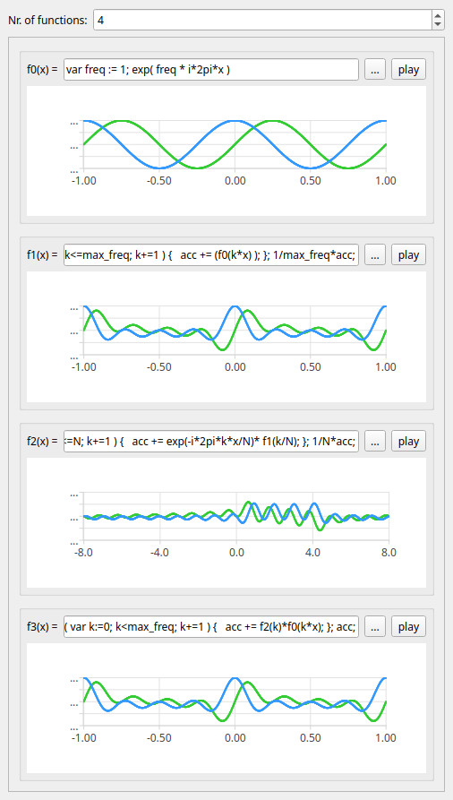

# Function Graph Explorer

This is an educational tool for the exploration of function graphs, the Fourier Transform, filter design and audio signal analysis.
The user may enter mathematical functions by typing formulae such as "f(x) = x^2" and is immediately being presented with the corresponding graph representation.
Additionally, every function can be listened to on the speakers by interpreting it as an audio signal.

The purpose of this software is to encourage people to experiment and play around.
The immediate visual and acoustic feedback and the hands-on experience deliver a means to gain intuition about advanced concepts such as mathematical modeling, signal processing, audio synthesis and sound in a lightweight, playful way.

*Remember*:

Learning is fun.

Examples:

- How to change the amplitude, frequency or phase of an oscillation?
- How to compose complicated waveforms from simple sinusoids?
- What's the effect of a low pass filter on the frequency spectrum and sound of a signal?
- How does the Fourier Transform work?
- How to resynthesise a signal from it's frequence components?

*Remark:*

This project is in an early stage. Functionality is still incomplete and might change rapidly.

## Screenshots:

## Demos:

[Demo Video](https://youtube.com/watch?v=EP8U7SJlOHM):

# Concept

The data model is based on the idea of chaining mathematical functions.
A function in this chain may use the output of a preceding function as input.
Each function may be considered one step in a processing pipeline and - depending on the context and the application - represents an operation such as a generator, a filter, some transformation or data analysis (e.g. Fourier Transform).

# Supported Platforms

So far only tested on Linux.
Depends on the [Jack sound server](https://jackaudio.org/) for audio playback.

# Technologies

This is programming exercise about development of user applications and graphical user interface design in C++.

Technologies:

- [Qt](https://www.qt.io/): Modern, platform independent Graphical User Interfaces
- [exprtk](https://www.partow.net/programming/exprtk/index.html): Software Library for mathematical expressions

# Build

## Build With Conan

You need [conan](https://conan.io/) installed. Issuing the following command will fetch external dependencies if necessary and build the project:

    $ conan profile detect --force
    $ ./scripts/conan_build.fish

# Run

    $ ./scripts/run.fish

# Clean Output

    $ ./scripts/clean.fish

# Build and Run Tests

    $ ./scripts/conan_test.fish

# Build and Run Benchmarks

    $ ./scripts/conan_benchmark.fish

# Suggested Editor Config

When coding vim / nvim, you might want to use a "language client"/linter to add just-in-time compilation, inline hints, etc.
[ALE](https://github.com/dense-analysis/ale) delivers this.
When coding with vim / nvim & [ALE](https://github.com/dense-analysis/ale) in a complex setup (cmake, Qt), the plugin might fail to locate source/include files.
Building the projects creates `./compile_commands.json`, which is supposed to solve this problem by guiding IDEs and plugins where to look for sources.

## Debugging with VIM

Try the [vimspector](https://github.com/puremourning/vimspector) plugin. The plugin needs a .vimspector.json.
The repository contains an example.

    $ .vimspector.json.example ./.vimspector.json

Adjust manually...
