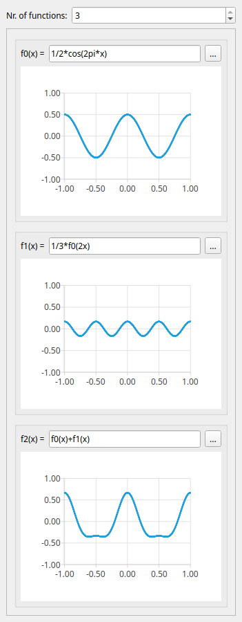
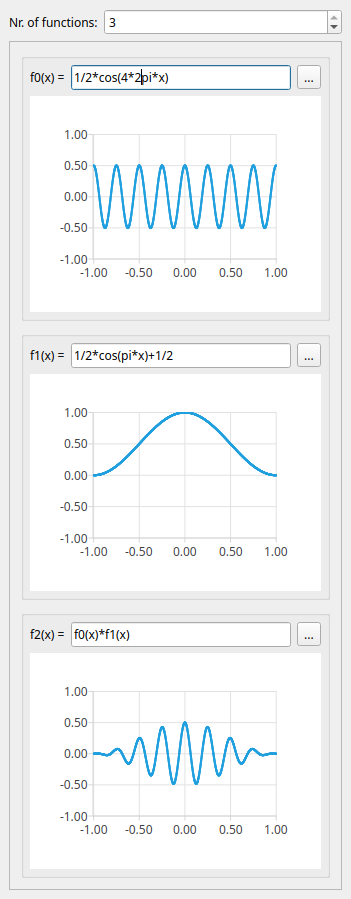

# Function Graph Explorer

This project is in an early stage. Functionality is still incomplete and will change rapidly.
Eventually, some time this might become a educational tool for exploring function graphs, the Fourier Transform, filter design and audio signal analysis.
Work in progress.

# Build

## Build Without Package Manager

You need to manually have the dependencies installed to your system, or at least somewhere `cmake` is going to find them.
If this is the case, issue

    $ ./scripts/build.fish

## Build With Conan

You need [conan](https://conan.io/) installed. Issuing the following command will fetch external dependencies if necessary and build the project:

    $ conan profile detect --force
    $ ./scripts/conan_build.fish

# Run

    $ ./scripts/run.fish

# Clean Output

    $ ./scripts/clean.fish

# Build and Run Tests

    $ ./scripts/conan_test.fish
